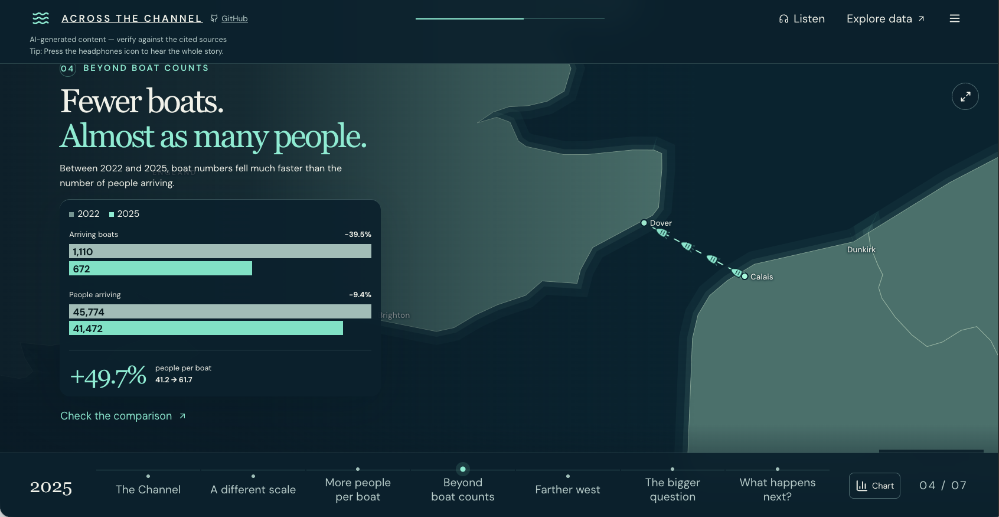

# Across the Channel

A map-led, narrated scroll story about UK small-boat arrivals: how many people arrive, how many boats carry them, and how average occupancy has changed since 2018. It ends with an adjustable scenario for exploring "what if" questions.

**It is not a prediction.** Historical figures come from source-checked official statistics. The scenario is explicitly hypothetical and is kept separate from the evidence.

**Live demo:** [across-the-channel.vercel.app](https://across-the-channel.vercel.app)



## Built with

- TypeScript (strict) and React 19, built with Vite
- MapLibre GL JS, with a locally hosted basemap and GeoJSON
- Python for the data and research pipeline
- OpenAI text-to-speech (`gpt-4o-mini-tts`) for narration, generated at build time; the site makes no API calls
- Vitest, Playwright and axe-core for testing
- Vercel for static hosting

## Run locally

Requires Node.js 22.12+ (tested with 24.18), Yarn 1.22, Python 3, and Google Chrome for browser tests. Narration tooling and its unit tests also require FFmpeg (`ffmpeg` and `ffprobe`) on PATH.

```sh
yarn install --frozen-lockfile
yarn dev
```

Open http://127.0.0.1:5173. Build a static release with `yarn build`; `yarn preview` serves the resulting `dist/` folder.

For a phone on the same Wi-Fi, open the **Network** URL printed by Vite. Both `yarn dev` and `yarn preview` listen on all network interfaces. If the default port is already occupied, use the port printed by Vite. The computer must remain running and connected to the network.

The home page is the single map-led scroll story: six narrated chapters followed by an optional scenario. The bottom chart button opens the annual series; the map button opens pan, zoom, reset and fullscreen controls. The story menu includes the full data table, CSV download, design foundations and display preferences.

`/?year=2026` opens that year in the interactive map. Older `?view=explore&year=…` links are normalized to the story while preserving the year. Chapter links include `/#comparison`, `/#farther-west` and `/#scenarios`.

## Deploy

The site is static and needs no server or secrets at runtime. It is set up for [Vercel](https://vercel.com): `vercel.json` sets the Vite framework, `yarn install --frozen-lockfile`, `yarn build` and the `dist` output, and `package.json` `engines` selects Node.js 22.12 or later, below 25.

The live site is deployed with the Vercel command line from a clean export of `main`, so git-ignored files such as `.env.local` and `.cache/tts/` are never uploaded:

```sh
DEPLOY="$(mktemp -d)/across-the-channel"   # the folder name becomes the Vercel project name
mkdir -p "$DEPLOY"
git archive main | tar -x -C "$DEPLOY"
cd "$DEPLOY"
npx vercel deploy --prod --yes
```

Pushing to `main` does not redeploy the site. To deploy on every push instead, import the GitHub repository into Vercel with `main` as the production branch.

Do not add environment variables: normal builds never call OpenAI, so `OPENAI_API_KEY` must not be set on Vercel. Any other static host works with the same build command and output folder. A host that serves the site from a sub-path, such as a GitHub Pages project site, also needs Vite's `base` option set to that path.

## Narration recordings and tooling

The [implementation plan](docs/narration/narration-implementation-plan.md) tracks the static recordings. All 15 recordings are retained for compatibility and review; the story uses six relevant clips. Press Listen to start or resume, and Pause to stop. Manual navigation/scrolling and opening data or map dialogs pause playback. On mobile, narration gently reveals the copy unless reduced motion is enabled. Finishing the takeaway scrolls to the optional scenario and stops audio; edited scenario assumptions are not narrated.

The AI voice disclosure and transcript are shown on desktop; the floating transcript box is hidden on mobile to keep the map visible. The [recording review page](https://across-the-channel.vercel.app/audio/narration/review.html) (`/audio/narration/review.html` when running locally) provides the complete transcripts and recordings. Pronunciation and tone review remain pending.

Compatible manifests and validated audio bytes are cached in browser Cache Storage. Current/next clips are prepared ahead of playback; unavailable storage falls back to direct asset URLs. Cached clips can play when their network requests fail in an already loaded app; offline page loading is not provided. Missing audio, rejected playback or stalled loading lets the story continue silently. A recording watchdog uses its measured duration plus 20 seconds of active time; loading/no-progress recovery uses 15 seconds. Pauses do not consume these timers.

```sh
yarn narration:transcript              # Regenerate the review document; no API
yarn narration:build --cache=only      # Publish only from valid local cache; no API
yarn narration:build                   # Generate missing clips (billable API calls)
yarn narration:build --cache=refresh   # Regenerate all clips (billable API calls)
yarn narration:build --cache=off       # Generate without saving a local cache
yarn narration:check                   # Strictly validate an existing audio manifest
yarn narration:cache:prune --keep-days=30
```

Generation reads `OPENAI_API_KEY` from the process environment first, then `.env.local`, only when a recording is missing. Do not use a `VITE_` prefix for the key. `.env.local` and `.cache/tts/` are ignored by Git. Set `TTS_CACHE_DIR` to move the local cache; keep custom cache directories outside version control. Run only one narration build or cache-prune command at a time.

`public/audio/narration/manifest.json` and its MP3s are prepared as static assets; commands do not commit files. Request hashes identify cache entries, while audio-byte hashes identify published files. Failed generation preserves the previous manifest. Older public recordings are retained for older open pages and must be managed deliberately when preparing releases. Local pruning removes only old unused entries and unreferenced old audio.

The client uses the [OpenAI speech API](https://developers.openai.com/api/reference/cli/resources/audio/subresources/speech/methods/create), with `gpt-4o-mini-tts`, `sage` and MP3 output. It retries HTTP 429/5xx at most three times, respects Retry-After up to 60 seconds and avoids automatic retries after ambiguous network failures. Costs are not measured by this command. Audio validity and duration are checked with ffprobe; listening review remains necessary.

Normal builds and checks never call OpenAI. The main check now includes `narration:check`, which fails if recordings are absent, corrupt or stale. Unit tests use locally generated tones and fake API responses; browser tests also load all delivered recordings and exercise real audio playback on the review page.

## Included features

- Seven scroll sections: six evidence chapters and one adjustable, explicitly hypothetical scenario.
- A persistent Channel map with illustrative boat movement and a separate interactive map dialog with year selection, pan, zoom, reset and fullscreen.
- Indicative Calais–Dover context, qualified 2026 Portsmouth endpoints and amber hypothetical connections.
- Annual chart metric/year selection, complete data table, CSV download and source calculations.
- Independent scenario occupancy, arriving-boat and geographic controls; no route-level allocation of totals.
- Light/dark themes, persistent 100–200% text controls and a live design-foundations preview.
- Optional listening, motion pause/replay controls and reduced-motion support.
- Keyboard controls, native dialogs and map-failure text alternatives.
- [Design system](docs/project/DESIGN_SYSTEM.md) and [WCAG 2.2 AA verification scope](docs/project/ACCESSIBILITY.md).

## Evidence and updating data

Annual counts for 2018–2025 come from the pinned Home Office June 2026 summary tables. The separate provisional 2026 snapshot covers **1 January–3 September**, with 16,513 people and 244 boats. The existing research CSV retains its earlier January–June row; it has not been silently overwritten.

`research/crossings/annual-crossings.csv` → `scripts/build_data.py` → `src/data/crossings.json`.

The later provisional snapshot and provenance live in `research/mvp-2026-snapshot.json`, backed by `research/raw/small-boats-2026-09-04.ods`. The data check reconciles its daily totals. Update the source files, their metadata and date coverage before running:

```sh
yarn data:build
yarn run check
```

When moving the 2026 cutoff, also update the explicit partial-year captions, extraction coverage assertions and tests. The date in the selected-year panel is derived from the record. Do not replace a complete year's totals with a partial-year value or mix provisional and quarterly figures without labelling them.

Numeric records have been source-checked. The claim registry was critically reviewed ([critical-review.md](research/critical-review.md)) and approved with conditions on 11 September 2026 ([approval.json](research/approval.json)); only approved claims may be displayed. The first version of the app was built before that review, and the app has not yet been fully revised to the approved research. The move to the scroll story is not a new research sign-off. Unsupported engine, vessel-size and route-range estimates are not used as historical facts. See [methodology](docs/project/METHODOLOGY.md), [scenario assumptions](docs/project/SCENARIO_MODEL.md), and [research gaps](research/data-gaps.md).

## Checks

```sh
yarn run check   # Data and narration checks, Prettier, unit tests, strict TypeScript build, browser tests
yarn test        # Calculation, provenance and scenario tests
yarn test:e2e    # Desktop + mobile Chromium, accessibility and failure behavior
```

The Playwright configuration uses installed Google Chrome. On CI, install Chrome using `yarn playwright install chrome`, or adapt the configuration to an installed Chromium channel. Browser tests need permission to run Chrome and access localhost. Screenshots and traces go to ignored `test-results/`.

## Limits

This is an early public version (see the live demo above), not a finished production service. Legacy scenario recordings remain on the review page; the adjustable scenario is explicitly hypothetical and is not narrated. Narration is AI-generated and still requires listening review. The basemap is generalized, with approximate city labels; it is not a navigational chart. No terrain elevation, measured vessel-size model, inferred historical tracks, vessel-range model or probabilistic forecast is included. The 60 FPS goal has not yet been certified on physical mobile devices. Automated Chromium mobile emulation is not Safari testing.

MapLibre is loaded separately and remains the largest dependency. The retired explorer and Three.js bundle have been removed. Fonts and basemap are served locally; runtime data does not require external APIs or credentials. See [architecture](docs/project/ARCHITECTURE.md) and [source/asset notes](docs/project/DATA_SOURCES.md).
